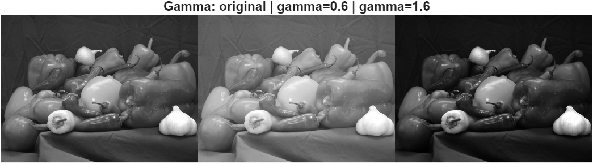

# Lab 1 – Image as a 2D Signal

This lab explores how a digital image can be interpreted as a two-dimensional signal, and how **quantization**, **dynamic range**, **gamma correction**, and **sampling** affect its visual and numerical properties.

---

## 0️⃣ Load and Inspect
**Original RGB and Grayscale images.**  
- The grayscale image has an 8-bit range (0–255).  
- Data type and size are printed in the console.

---

## 1️⃣ Quantization (Bit Depth)
**Comparison: 8-bit vs ~6-bit vs ~4-bit.**  
- Reducing bit depth limits the number of intensity levels.  
- Visible effects: **banding** and **loss of smooth gradients**.

---

## 2️⃣ Histogram and Contrast Stretching
**Linear contrast enhancement using `imadjust`.**  
- The histogram is stretched to cover the full range [0,1].  
- Enhances visibility of dark or bright regions.

---

## 3️⃣ Gamma Correction (Nonlinear Adjustment)
**Gamma < 1:** brightens midtones.  
**Gamma > 1:** darkens highlights.  
- Unlike contrast stretching, gamma correction is **nonlinear** and perceptual.

---

## 4️⃣ Sampling and Aliasing
**Aggressive downsampling (10%) and upsampling back.**  
- Fine details are lost, producing blocky or repetitive patterns.  
- According to the **Nyquist theorem**, undersampling causes aliasing artifacts.

---

## 5️⃣ Reflections
1. Lower bit depth → visible posterization and reduced detail.  
2. Contrast stretching redistributes intensity values → better visibility.  
3. Gamma correction changes brightness **nonlinearly**, mimicking human vision.  
4. Undersampling violates Nyquist → aliasing and false spatial frequencies.
